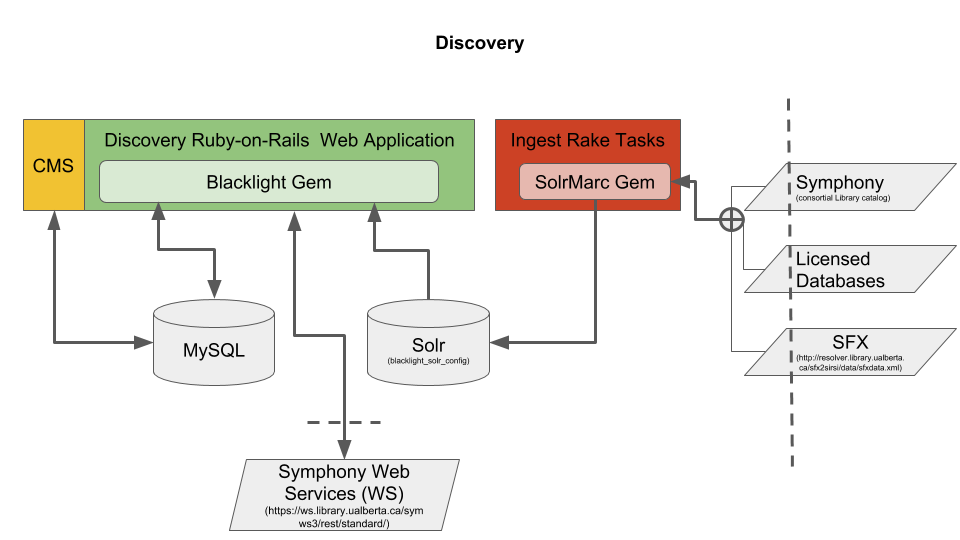

# Discovery Interface for University of Alberta Library
[](https://travis-ci.org/ualbertalib/discovery)

This is the code base for the University of Alberta Library's
discovery platform. Based on [Project Blacklight](projectblacklight.org).

*   Depends on [Ruby](https://www.ruby-lang.org/en/) 2.5.x
*   Depends on Java (for SolrMarc and Ingestion scripts)
*   Depends on [xmllint](http://xmlsoft.org/xmllint.html) (for SFX Ingestion scripts) which is available in `sudo apt install libxml2-utils` on Ubuntu.
*   Depends on an instance of [Solr](https://lucene.apache.org/solr/) with [this configuration](https://github.com/ualbertalib/blacklight_solr_conf)
*   If you wish to use docker for the datastores install [docker](https://docs.docker.com/install/) and [docker-compose](https://docs.docker.com/compose/install/) first.

## Architecture


## To get the application up and running for development:

1.  clone this repository (`git clone https://github.com/ualbertalib/discovery`)
2.  run `docker-compose -f docker-compose.lightweight.yml up -d`
3.  run `bundle install`
4.  run `bundle exec rake db:setup`
5.  `bundle exec rake ingest[database_test_set] && bundle exec rake ingest[sfx_test_set] && bundle exec rake ingest[symphony_test_set]` (need Java Installed to run this)
    If you're looking to use a production like dataset or avoid the hassle of running docker and performing these ingest tasks, `export SOLR_URL=http://solrcloud-test.library.ualberta.ca:8080/solr/discovery-test`
6.  `bundle exec rails s`
7.  Point your browser to **<http://localhost:3000/catalog>**

## To run the tests:

Unit and Acceptance Tests

1.  `bundle install --without development production`
2.  `RAILS_ENV=test bundle exec rake db:create`
3.  `RAILS_ENV=test bundle exec rake db:migrate`
4.  `bundle exec rake spec`

Integration tests (run against <http://search-test.library.ualberta.ca/>)

1.  `cpan WWW::Mechanize && cpan JSON && cpan HTML::TreeBuilder::XPath` to install perl dependencies
2.  `wget -O /var/tmp/mobyDick.txt http://www.gutenberg.org/ebooks/2701.txt.utf-8` your first visit to gutenberg might give you non utf-8 characters when it says, "hello stranger."
3.  `cd test/grabBag`
4.  `./allTests.pl`

## Additional Tasks for uat, staging and production

1.  `bundle exec rake assets:precompile` this can take several minutes
2.  create cron jobs to ingest `bundle exec rake ingest[sfx]`, `bundle exec rake ingest[databases]`, `bundle exec rails g symphony_nightly  && bundle exec rake db:migrate` and clean session table `bundle exec rake sessions:cleanup`

## UAT
Go [here](https://github.com/ualbertalib/di_internal/blob/master/System-Adminstration/UAT-Environment.md#access-discovery-uat-instance) for information about accessing Discovery UAT instance.

## Ingest

The standard library cataloguing data format is [MARC](https://www.loc.gov/marc/marcdocz.html). MARC uses numeric fields to contain bibliographic information in the form of text strings that use a [content standard](https://en.wikipedia.org/wiki/International_Standard_Bibliographic_Description) to format the text and, perhaps more importantly, the punctuation. Each MARC field can be subdivided into alphabetical subfields which generally either a) containing repeated elements or b) subdivide the text string. MARC fields and subfields are often written out as e.g. **245$a** which means field number 245 (= title), subfield a.

In SolrMarc, the library currently being used to index Blacklight data, the mapping of MARC fields occurs [here](https://github.com/ualbertalib/discovery/blob/master/config/SolrMarc/symphony_index.properties) with more sophisticated data manipulation using BeanShell happening in [these scripts](https://github.com/ualbertalib/discovery/tree/master/config/SolrMarc/index_scripts). Once the fields have been mapped, they can be designated for search and/or display in the appropriate Solr config file (either schema.xml or solrconfig.xml).

`bundle exec rake ingest[collection]` where collection is mainly 'symphony', 'sfx', 'kule' or 'databases'.  See `config/ingest.yml` for other collections. Most collections are expected to be represented by a file in a `./data` directory.

By default the solr target (:url) is set from '#{Rails.env}' stanza in config/blacklight.yml. Alternately you can set the SOLR_INGEST_URL directly.
```
export SOLR_INGEST_URL=http://localhost:8983/solr/your-new-solr-collection
bundle exec rake ingest[collection]
unset SOLR_INGEST_URL # if desired
```

To populate the human readable strings for the 'Where is this?' table.  Assuming `./data/data4discovery.txt` and `./data/Data4DiscoveryManual.txt` are present then you can invoke `bundle exec rails g symphony_nightly  && bundle exec rake db:migrate` to populate the tables with the latest configurations. If for some reason this doesn't go well, `bundle exec rake db:rollback` and delete the migration at `db/migrate/<todays date>_symphony_nightly_<todays date>.rb` will revert to a known good state.
